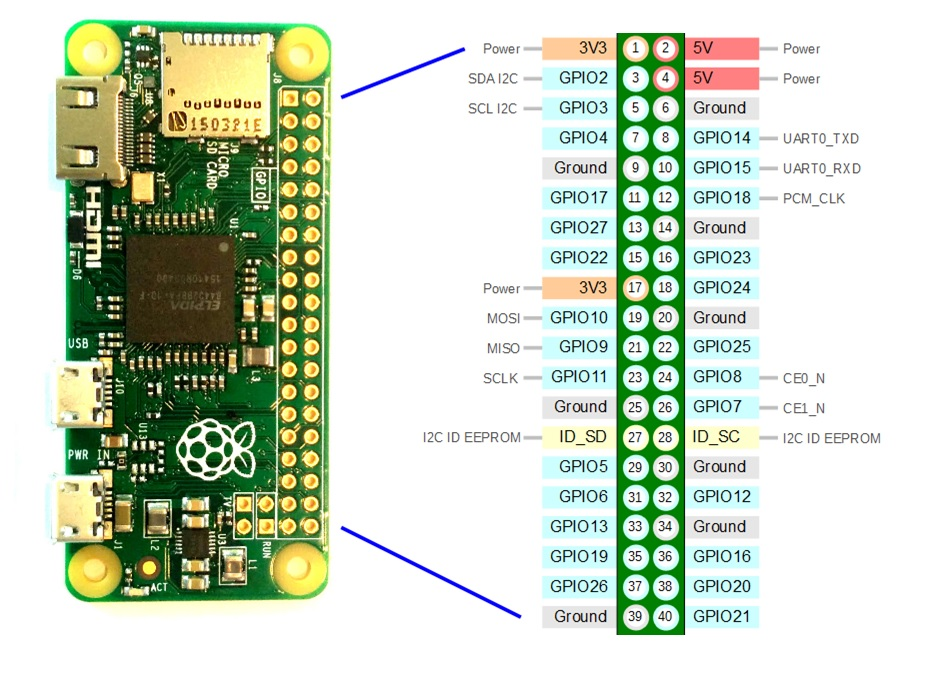

## About this repo

This repo is made to encompass the installation process of the **Raspberry Pi** (Rpi).\
Several projects I will be working on, will use the Rpi board so for the sake of convenience the installation processes and initial setups wil be described here and this repo referenced on the projects where needed.

The boards I own and use are:
* [**Raspberry Pi 4 model B 8gb**](https://www.raspberrypi.org/products/raspberry-pi-4-model-b/specifications/)

Technical Specifications |
--------------------------
Broadcom BCM2711, Quad core Cortex-A72 (ARM v8) 64-bit SoC @ 1.5GHz |
VideoCore VI 3D graphics core |
8GB LPDDR4-3200 SDRAM |
2.4 GHz and 5.0 GHz IEEE 802.11ac wireless |
Bluetooth 5.0 and BLE |
Gigabit Ethernet |
2 USB 3.0 ports; 2 USB 2.0 ports |
Raspberry Pi standard 40 pin GPIO header |
2 × micro-HDMI ports (up to 4kp60 supported) |
2-lane MIPI DSI display port |
2-lane MIPI CSI camera port |
4-pole stereo audio and composite video port |
Micro SD card slot |

GPIO Pinout

-----------------------------------------

* [**Raspberry Pi Zero W**](https://www.raspberrypi.org/products/raspberry-pi-zero-w/)

Technical Specifications |
--------------------------
Size: 66 x 30.5 x 5 mm |
Weight: 9 grams |
Broadcom BCM2835, 1GHz, single-core ARM1176JZF-S CPU |
512MB RAM |
802.11 b/g/n wireless LAN |
Bluetooth Low Energy (BLE) |
Bluetooth 4.1 |
Mini HDMI |
Micro USB power and USB On-The-Go ports |
HAT-compatible 40-pin header |
Composite video and reset headers |
CSI camera connector |
Micro SD card slot |

--------------------------------------------

* [**Raspberry Pi 2 model B**](https://www.raspberrypi.org/products/raspberry-pi-2-model-b/)

Technical Specifications |
--------------------------
Size: 85.6 x 56.5 x 17 mm |
Weight: 45g |
Broadcom BCM2836, 900MHz quad-core ARM Cortex-A7 CPU |
VideoCore IV 3D graphics core |
1GB RAM |
100 Base Ethernet |
4 USB 2.0 ports |
40 GPIO pins |
Full HDMI port |
Combined 3.5mm audio jack and composite video |
Camera interface (CSI) |
Display interface (DSI) |
Micro SD card slot |

----------------------------------------------

* **Raspberry pi 1 model B** (_discontinued_)
  
Technical Specifications |
--------------------------
Size: 85.6 x 56.5 x 17 mm |
Weight: 45g |
Broadcom BCM2835, 700MHz single core ARM1176JZF-S CPU |
VideoCore IV 3D graphics core |
512Mb RAM |
100 Base Ethernet |
2 USB 2.0 ports |
26 GPIO pins |
Full HDMI port |
3.5mm audio jack |
Composite video jack |
Camera interface (CSI) |
Display interface (DSI) |
SD card slot |

------------------------------------------------
# Installing the OS to the SD card
Get the OS (Operating System) image you want to install from the official website: [Raspberry Pi OS](https://www.raspberrypi.org/software/operating-systems/). \
Keep in mind the hardware limitations of the Pi you are using when choosing the system. Being too greedy will only lead to a frustrating experience. Also the SD card should be a verified one as some instances of the pi not booting are due to incompatible SD cards.\
To write the chosen OS to the SD card use the [Raspberry Pi Imager](https://www.raspberrypi.org/software/). You could skip the first step as the Pi Imager allows you to download the OS directly during the installation, but that makes the process **MUCH** longer.\
As a personal preference I usually format the SD cards to EXFAT not FAT32.\

***Pi Imager default screen*** \
\
Select "CHOOSE OS" option first to add the OS to install.

***Operating System selection pop out window***\
\
To install the downloaded image scroll to the very bottom and select "Use custom".\
(In this example I'm installing ***Ubuntu 20.10 Server***.)

***SD Card selection pop out window***\
\
Here a 323Gb card is detected.

***Writing the OS to the card***\
\
This process takes around 10mn depending on your system RAM.

***All set***\
