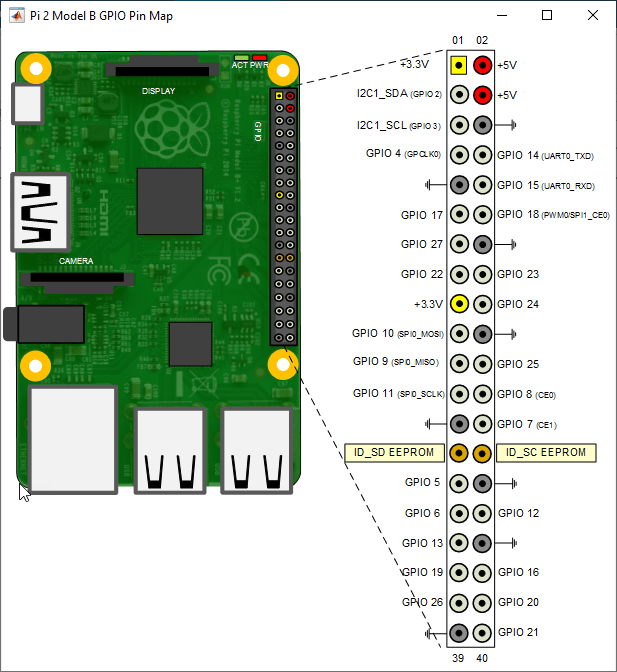

## About this repo

This repo is made to encompass the installation process of the **Raspberry Pi** (Rpi).\
Several projects I will be working on, will use the Rpi board so for the sake of convenience the installation processes and initial setups wil be described here and this repo referenced on the projects where needed.

The boards I own and use are:
* [**Raspberry Pi 4 model B 8gb**](https://www.raspberrypi.org/products/raspberry-pi-4-model-b/specifications/)

Technical Specifications |
--------------------------
Broadcom BCM2711, Quad core Cortex-A72 (ARM v8) 64-bit SoC @ 1.5GHz |
VideoCore VI 3D graphics core |
8GB LPDDR4-3200 SDRAM |
2.4 GHz and 5.0 GHz IEEE 802.11ac wireless |
Bluetooth 5.0 and BLE |
Gigabit Ethernet |
2 USB 3.0 ports; 2 USB 2.0 ports |
Raspberry Pi standard 40 pin GPIO header |
2 × micro-HDMI ports (up to 4kp60 supported) |
2-lane MIPI DSI display port |
2-lane MIPI CSI camera port |
4-pole stereo audio and composite video port |
Micro SD card slot |

GPIO Pinout

-----------------------------------------

* [**Raspberry Pi Zero W**](https://www.raspberrypi.org/products/raspberry-pi-zero-w/)

Technical Specifications |
--------------------------
Size: 66 x 30.5 x 5 mm |
Weight: 9 grams |
Broadcom BCM2835, 1GHz, single-core ARM1176JZF-S CPU |
512MB RAM |
802.11 b/g/n wireless LAN |
Bluetooth Low Energy (BLE) |
Bluetooth 4.1 |
Mini HDMI |
Micro USB power and USB On-The-Go ports |
HAT-compatible 40-pin header |
Composite video and reset headers |
CSI camera connector |
Micro SD card slot |

--------------------------------------------

* [**Raspberry Pi 2 model B**](https://www.raspberrypi.org/products/raspberry-pi-2-model-b/)

Technical Specifications |
--------------------------
Size: 85.6 x 56.5 x 17 mm |
Weight: 45g |
Broadcom BCM2836, 900MHz quad-core ARM Cortex-A7 CPU |
VideoCore IV 3D graphics core |
1GB RAM |
100 Base Ethernet |
4 USB 2.0 ports |
40 GPIO pins |
Full HDMI port |
Combined 3.5mm audio jack and composite video |
Camera interface (CSI) |
Display interface (DSI) |
Micro SD card slot |

----------------------------------------------

* **Raspberry pi 1 model B** (_discontinued_)
  
Technical Specifications |
--------------------------
Size: 85.6 x 56.5 x 17 mm |
Weight: 45g |
Broadcom BCM2835, 700MHz single core ARM1176JZF-S CPU |
VideoCore IV 3D graphics core |
512Mb RAM |
100 Base Ethernet |
2 USB 2.0 ports |
26 GPIO pins |
Full HDMI port |
3.5mm audio jack |
Composite video jack |
Camera interface (CSI) |
Display interface (DSI) |
SD card slot |

------------------------------------------------